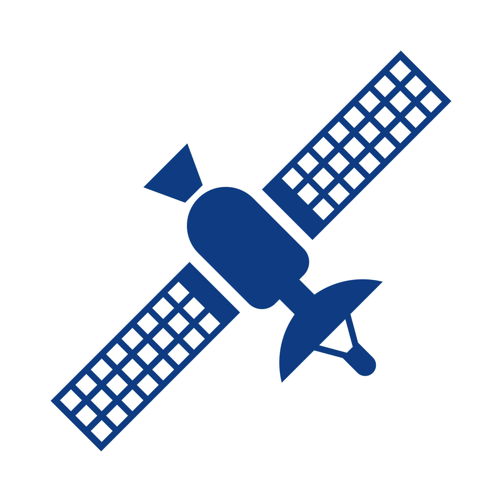

<h1 align="center">
   
</h1>

## ⚡️ O Projeto
  Ubernet é um aplicativo desenvolvido para o hackaton Inatel App Challenge com a finalidade de encontrar planos e fornecedores de internet próximos ao cliente.
## 🎯 Funcionalidades
 - Login com email e senha 
 - Versão para Cliente e para Instalador
 - Encontrar os instaladores mais próximos de você com seus planos disponíveis
 - Mapa com todos os instaladores do Brasil
 - Agendar uma instalação
 - Realizar comunicação entre cliente e instalador
  
## 🖥️ Tecnologias Usadas
 - [Swift](https://www.apple.com/br/swift/)
 - [SwiftUI](https://developer.apple.com/xcode/swiftui/)
 - [Firebase](https://firebase.google.com/?hl=pt)

## ⚙️ Instruções para instalação
  1. Instale o [Xcode](https://developer.apple.com/xcode/download/);
  1. Clone esse repositório;
  1. Abra "Ubernet.xcworkspace" no Xcode;
  1. Vá no Xcode em Preferences > Accounts e adicione seu Apple ID;
  1. Na barra de opções do Xcode selecione "Ubernet" e vá para General > Identity. Adicione uma palavra no final do *Bundle Identifier* e.g. com.FabioFiorita.Ubernet*.name* para que se torne único. Selecione seu Apple ID em Signing > Team;
  1. Conecte seu iPad ou iPhone usando um cabo USB e o selecione em Xcode's Product menu > Destination;
  1. Aperte CMD+R ou Product > Run para instalar;
  1. Se você instalar usando uma conta grátis (não-desenvolvedor), certifique-se de executar o programa a cada 7 dias, ou ele fechará assim que abrir qunado sua certificação expirar.
 

